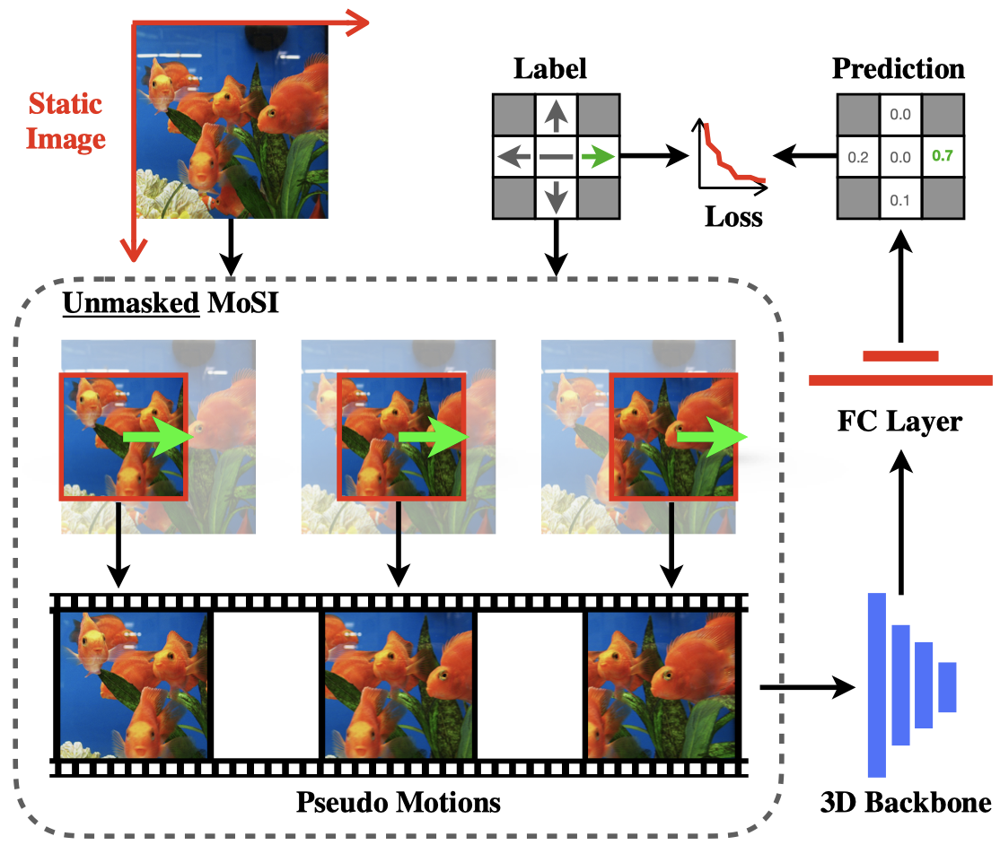

# Self-supervised Motion Learning from Static Images (CVPR 2021)
[Ziyuan Huang](https://huang-ziyuan.github.io/), [Shiwei Zhang](https://scholar.google.com/citations?user=ZO3OQ-8AAAAJ&hl=zh-CN&authuser=1), Jianwen Jiang, Mingqian Tang,
[Rong Jin](https://www.cse.msu.edu/~rongjin/), [Marcelo Ang](https://www.eng.nus.edu.sg/me/staff/ang-jr-marcelo-h/), <br/>
In CVPR, 2021. 

[[Paper](https://openaccess.thecvf.com/content/CVPR2021/papers/Huang_Self-Supervised_Motion_Learning_From_Static_Images_CVPR_2021_paper.pdf)]

# Running instructions
To train the model with MoSI, set the `_BASE_RUN` to point to `configs/pool/run/training/mosi.yaml`. See `configs/projects/mosi/mosi_*.yaml` for more details. Alternatively, you can also find some pre-trained model in the `MODEL_ZOO.md`.

For detailed explanations on the approach itself, please refer to the [paper](https://openaccess.thecvf.com/content/CVPR2021/papers/Huang_Self-Supervised_Motion_Learning_From_Static_Images_CVPR_2021_paper.pdf).

For an example run, set the `DATA_ROOT_DIR`, `ANNO_DIR` and `NUM_GPUS` in `configs/projects/mosi/mosi_r2d3ds_hmdb.yaml`, and run the command

```
python runs/run.py --cfg configs/projects/mosi/pt-hmdb/r2d3ds.yaml
```

<br/>
<div align="center">
    
</div>
<br/>

# Citing MoSI
If you find MoSI useful for your research, please consider citing the paper as follows:
```BibTeX
@inproceedings{mosi2021,
  title={Self-supervised motion learning from static images},
  author={Huang, Ziyuan and Zhang, Shiwei and Jiang, Jianwen and Tang, Mingqian and Jin, Rong and Ang, Marcelo H},
  booktitle={{CVPR}},
  pages={1276--1285},
  year={2021}
}
```