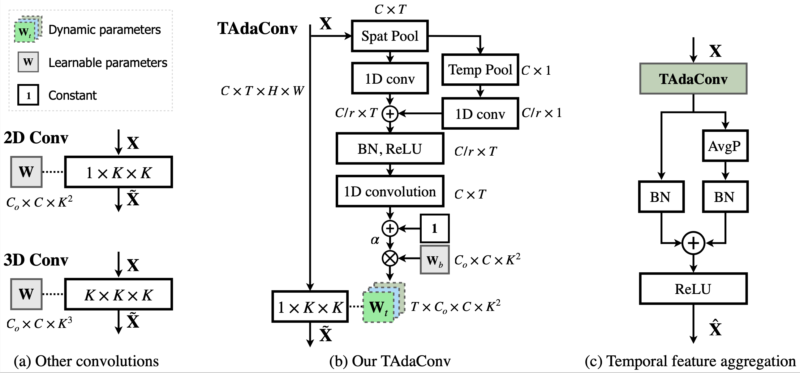

# TAda! Temporally-Adaptive Convolutions for Video Understanding (ICLR 2022)
[Ziyuan Huang](https://huang-ziyuan.github.io/), [Shiwei Zhang](https://scholar.google.com/citations?user=ZO3OQ-8AAAAJ&hl=zh-CN&authuser=1), [Liang Pan](https://scholar.google.com/citations?user=lSDISOcAAAAJ&hl=zh-CN&authuser=1), [Zhiwu Qing](https://scholar.google.com/citations?user=q9refl4AAAAJ&hl=zh-CN&authuser=1),
Mingqian Tang, [Ziwei Liu](https://liuziwei7.github.io/), [Marcelo Ang](https://www.eng.nus.edu.sg/me/staff/ang-jr-marcelo-h/), <br/>
In ICLR, 2022. 

[[Paper](https://arxiv.org/pdf/2110.06178)][[Project homepage](https://tadaconv-iclr2022.github.io)]

# Running instructions
To train TAda2D networks, set the `_BASE_MODEL` to point to `configs/pool/backbone/tada2d.yaml`. See `configs/projects/tada/tada2d_*.yaml` for more details. 
TAda2D networks trained on Kinetics and Something-Something can be found in [`MODEL_ZOO.md`](../../MODEL_ZOO.md).

For an example run, set the `DATA_ROOT_DIR`, `ANNO_DIR` and `NUM_GPUS` in `configs/projects/tada/tada2d_k400.yaml`, and run the command

```
python runs/run.py --cfg configs/projects/tada/k400/tada2d_8x8.yaml
```

<br/>
<div align="center">
    
</div>
<br/>


# Model Zoo

| Dataset | architecture | #frames x sampling rate | top1 | top5| checkpoint | config |
| ------------ | ------------ | ------------ | ------------ | ------------ | ------------ | ------------ |
| K400 | TAda2D-R50 | 8 x 8 | 76.7 | 92.6 | [[google drive](https://drive.google.com/file/d/1YsbTKLoDwxtStAsP5oxUMbIsw85NvY0O/view?usp=sharing)][[baidu](https://pan.baidu.com/s/1rPPZtVDlEoftkg-r_Di59w)(code:p06d)] |  [tada2d_8x8.yaml](../../configs/projects/tada/k400/tada2d_8x8.yaml) |
| K400 | TAda2D-R50 | 16 x 5 | 77.4 | 93.1 | [[google drive](https://drive.google.com/file/d/1UQDurxakmnDxa5D2tBuTqTH60BVyW3XM/view?usp=sharing)][[baidu](https://pan.baidu.com/s/1MzFCZU1G1JR2ur9gWd3hCg)(code:6k8h)] | [tada2d_16x5.yaml](../../configs/projects/tada/k400/tada2d_16x5.yaml) |
| SSV2 | TAda2D-R50 | 8 | 64.0 | 88.0 | [[google drive](https://drive.google.com/file/d/16y6dDf-hcMmJ2jDCV9tRla8aRJZKJXSk/view?usp=sharing)][[baidu](https://pan.baidu.com/s/1CWy35SlWMbKnYqZXESndKg)(code:dlil)] | [tada2d_8f.yaml](../../configs/projects/tada/ssv2/tada2d_8f.yaml) | 
| SSV2 | TAda2D-R50 | 16 | 65.6 | 89.1 | [[google drive](https://drive.google.com/file/d/1xwCxuFW6DZ0xpEsp_tFJYQRGuHPJe4uS/view?usp=sharing)][[baidu](https://pan.baidu.com/s/1GKUKyDytaKKeCBAerh-4IQ)(code:f857)] | [tada2d_16f.yaml](../../configs/projects/tada/ssv2/tada2d_16f.yaml) | 

# Citing TAda!
If you find TAdaConv or TAda2D useful for your research, please consider citing the paper as follows:
```BibTeX
@inproceedings{huang2021tada,
  title={TAda! Temporally-Adaptive Convolutions for Video Understanding},
  author={Huang, Ziyuan and Zhang, Shiwei and Pan, Liang and Qing, Zhiwu and Tang, Mingqian and Liu, Ziwei and Ang Jr, Marcelo H},
  booktitle={{ICLR}},
  year={2022}
}
```