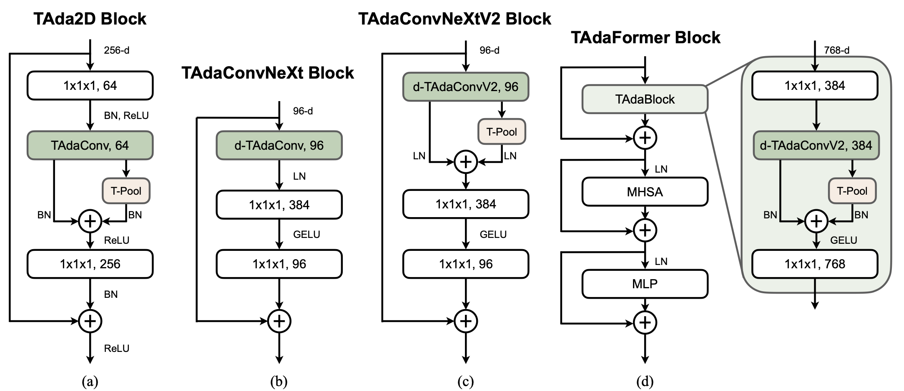

# Temporally-Adaptive Models for Efficient Video Understanding
[Ziyuan Huang](https://huang-ziyuan.github.io/), [Shiwei Zhang](https://scholar.google.com/citations?user=ZO3OQ-8AAAAJ&hl=zh-CN&authuser=1), [Liang Pan](https://scholar.google.com/citations?user=lSDISOcAAAAJ&hl=zh-CN&authuser=1), [Zhiwu Qing](https://scholar.google.com/citations?user=q9refl4AAAAJ&hl=zh-CN&authuser=1),
Yingya Zhang, [Ziwei Liu](https://liuziwei7.github.io/), [Marcelo Ang](https://www.eng.nus.edu.sg/me/staff/ang-jr-marcelo-h/), <br/>
In arXiv, 2022. 

[[Paper](https://arxiv.org/pdf/2308.05787.pdf)]

# Running instructions

To run TAdaFormer, set the `DATA_ROOT_DIR`, `ANNO_DIR` and `NUM_GPUS` in `configs/projects/tadaformer/tadaformer_b16_k400_16f.yaml`, and run the command

```
python runs/run.py --cfg configs/projects/tadaformer/tadaformer_b16_k400_16f.yaml
```

To run TAdaConvNeXtV2,  set the `DATA_ROOT_DIR`, `ANNO_DIR` and `NUM_GPUS` in `configs/projects/tadaconvnextv2/tadaconvnextv2_base_k400_16f.yaml`, and run the command

```
python runs/run.py --cfg configs/projects/tadaconvnextv2/tadaconvnextv2_base_k400_16f.yaml
```

Please refer to `configs/projects/tadaformer` and `configs/projects/tadaconvnextv2` for more details.

<br/>
<div align="center">
    
</div>
<br/>


# Model Zoo

### Kinetics 710 pretrained 
| arch. | pt.|  #frames | ckp. |
| ------------ | ------------ | ------------ | ------------ |
| TAdaFormer-B/16 | CLIP | 16 | [ckp](https://drive.google.com/file/d/1hKKdhg6gfxCxV8C6w9vxV6RNSsxTHqZO/view?usp=sharing) | 
| TAdaFormer-L/14 | CLIP | 16 | [ckp](https://drive.google.com/file/d/1GQlSTqvsQkRB7DexiFAl-MgK3OkqHm0C/view?usp=sharing) |
| TAdaFormer-L/14 | CLIP | 32 | [ckp](https://drive.google.com/file/d/1uNfkujaUIQo6RkjbrPKdTg-HHIBWVvbD/view?usp=sharing) |
| TAdaFormer-L/14 | CLIP | 64 | [ckp](https://drive.google.com/file/d/1NUbnnZ1EtQUfJ0kiLncIihQbnvbfu7NK/view?usp=sharing) |


### Kinetics 400
| arch. | pt. |#frames | GFLOPS | top1 | ckp. |
| ------------ | ------------ | ------------ | ------------ | ------------ | ------------ | ------------ |
| TAdaConvNeXtV2-T | IN1K | 16 | 47x3x4 | 79.6 | [ckp](https://drive.google.com/file/d/1_jkIOP8kYeMzgEGyVznDKXNRG2tSEOkV/view?usp=sharing) |
| TAdaConvNeXtV2-T | IN1K | 32 | 94x3x4 | 80.8 | [ckp](https://drive.google.com/file/d/1FSpmNgDETQ0WchABBUgpTLG9q3N9xBHN/view?usp=sharing) |
| TAdaConvNeXtV2-S | IN1K | 16 | 91x3x4 | 80.8 | [ckp](https://drive.google.com/file/d/12R74tV2-VRRUxrH0Tubki5voRSCbR3F1/view?usp=sharing) |
| TAdaConvNeXtV2-S | IN1K | 32 | 183x3x4 | 81.9 | [ckp](https://drive.google.com/file/d/15GDqJZSgy5fQ8gHgq3mEru_rWghelzP3/view?usp=sharing) |
| TAdaConvNeXtV2-S | IN21K | 32 | 183x3x4 | 82.9 | [ckp](https://drive.google.com/file/d/1yM-OHpzNOu0180vogZxiMDk9x45SlFFF/view?usp=sharing) | 
| TAdaConvNeXtV2-B | IN1K | 16 | 162x3x4 | 81.4 | [ckp](https://drive.google.com/file/d/1rtapp_GzQHe6CBrhcNfe4wuBAS106uIk/view?usp=sharing) |
| TAdaConvneXtV2-B | IN1K | 32 | 324x3x4 | 82.3 | [ckp](https://drive.google.com/file/d/1_VcPSEa4xd1npk1HMVihmXwzRsjk5xGd/view?usp=sharing) |
| TAdaConvNeXtV2-B | IN21K | 32 | 324x3x4 | **83.7** | [ckp](https://drive.google.com/file/d/1yyCKDa144iL1TsibNDFHaNW0dap2Xjpz/view?usp=sharing) |

| arch. | pt. |#frames | GFLOPS | top1 | ckp. |
| ------------ | ------------ | ------------ | ------------ | ------------ | ------------ | ------------ |
| TAdaFormer-B/16 | CLIP | 16 | 153x3x4 | 84.5 | [ckp](https://drive.google.com/file/d/1E7IE762YLJnfeiqtjv0jBb91_dZhNK0Q/view?usp=sharing) | 
| TAdaFormer-L/14 | CLIP | 16 | 703x3x4 | 87.6 | [ckp](https://drive.google.com/file/d/1chSLHo0nbFNObsLlCRSsAJE2vbYwIaYJ/view?usp=sharing) | 
| TAdaFormer-B/16 | CLIP+K710 | 16 | 153x3x4 | 86.6 | [ckp](https://drive.google.com/file/d/1pAhjXycxdT_eOH5kO-5t7y8o5MjtlQdZ/view?usp=sharing) |
| TAdaFormer-L/14 | CLIP+K710 | 16 | 703x3x4 | 88.9 | [ckp](https://drive.google.com/file/d/1qx3M33hsdoBcPsXihOdeViqI0VHUXnRf/view?usp=sharing) |
| TAdaFormer-L/14 | CLIP+K710 | 32 | 1406x3x4 | 89.5 | [ckp](https://drive.google.com/file/d/1T99YSQEe8yVUl3b03r_Wd04Qm36lN5Us/view?usp=sharing) |
| TAdaFormer-L/14 | CLIP+K710 | 64 | 2812x3x4 | **89.9** | [ckp](https://drive.google.com/file/d/1DBTfkCa0pHXqAm51gZSmmOVdGnBYacsM/view?usp=sharing) |

### Something-Something
The checkpoints in this part is provided for SSV2. 
| arch. | pt. |#frames | GFLOPS | SSV1 | SSV2 | ckp. |
| ------------ | ------------ | ------------ | ------------ | ------------ | ------------ | ------------ | ------------ |
| TAdaConvNeXtV2-T | IN1K+K400 | 16 | 47x3x2 | 54.1 | 67.2 | [ckp](https://drive.google.com/file/d/1IZaJ4EDrniK4ZxVYnl_2Y6qpx1F6UjqY/view?usp=sharing) |
| TAdaConvNeXtV2-T | IN1K+K400 | 32 | 94x3x2 | 56.4 | 69.8 | [ckp](https://drive.google.com/file/d/1WDJ5iMyR9VTkfeIoZwICtiJ8BSQ8u4gp/view?usp=sharing) | 
| TAdaConvNeXtV2-S | IN1K+K400 | 16 | 91x3x2 | 55.6 | 68.4 | [ckp](https://drive.google.com/file/d/1X94evPniWrjJfs38-SKPWehVZtYD3Xu7/view?usp=sharing) |
| TAdaConvNeXtV2-S | IN1K+K400 | 32 | 183x3x2 | 58.5 | 70.0 | [ckp](https://drive.google.com/file/d/17TP1v1el5hNBoyNPmTa5Zi_6ZrVJ7oi5/view?usp=sharing) | 
| TAdaConvNeXtV2-S | IN21K+K400 | 32 | 183x3x2 | 59.7 | 70.6 | [ckp](https://drive.google.com/file/d/1plKqnNGnDD5JpPZ_c8K8TZKTvynbrEg8/view?usp=sharing) |
| TAdaConvneXtV2-B | IN21K+K400 | 32 | 324x3x2 | **60.7** | **71.1** | [ckp](https://drive.google.com/file/d/1IIVxJlstPIVA9xunThZrp9RztBzsPyd6/view?usp=sharing) |

| arch. | pt. |#frames | GFLOPS | SSV1 | SSV2 | ckp. |
| ------------ | ------------ | ------------ | ------------ | ------------ | ------------ | ------------ | 
| TAdaFormer-B/16 | CLIP | 16 | 187x3x2 | 59.2 | 70.4 | [ckp](https://drive.google.com/file/d/1D-pKrxdrP2IcGXnd_e47ryci7OYCt8BK/view?usp=sharing)
| TAdaFormer-B/16 | CLIP | 32 | 374x3x2 | 61.2 | 71.3 | [ckp](https://drive.google.com/file/d/1uY9tt0rcP_bQDs36oBNWPaqzxqibBQFt/view?usp=sharing)
| TAdaFormer-L/14 | CLIP | 16 | 858x3x2 | 62.0 | 72.4 | [ckp](https://drive.google.com/file/d/1jXzh9_WFbrHAkrzijnNs0vIJHWTQNsbA/view?usp=sharing) | 
| TAdaFormer-L/14 | CLIP | 32 | 1716x3x2 | **63.7** | **73.6** | [ckp](https://drive.google.com/file/d/1hj8O3j_lf6VVp93nfy5z7zRGQ_W7Pou_/view?usp=sharing) |


# Citing TAdaFormer
If you find TAdaFormer useful for your research, please consider citing the paper as follows:
```BibTeX
@article{huang2023tadaconvv2,
  title={Temporally-Adaptive Models for Efficient Video Understanding},
  author={Huang, Ziyuan and Zhang, Shiwei and Pan, Liang and Qing, Zhiwu and Zhang, Yingya and Liu, Ziwei and Ang Jr, Marcelo H},
  journal={arXiv preprint arXiv:2308.05787},
  year={2023}
}
```